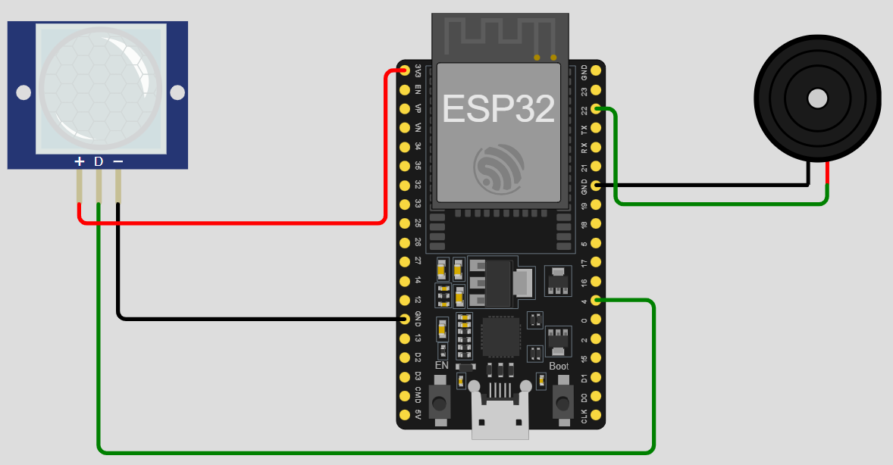

# ESP32-003-Motion-Activated-Doorbell🔔
A motion-activated doorbell system using ESP32, PIR sensor, and a buzzer. When someone approaches the door, the PIR sensor detects motion, and the ESP32 triggers the buzzer to sound, alerting you of a visitor.

---

## 🛠 Components Required

1. [ESP32 Development Board (30-pin)](https://robocraze.com/products/nodemcu-32-wifi-bluetooth-esp32-development-board30-pin?_pos=3&_psq=ESP32&_ss=e&_v=1.0)
2. [PIR Motion Sensor (HC-SR501)](https://robocraze.com/products/hcsr501-pir-motion-sensor-passive-infrared-sensor?_pos=1&_psq=PIR&_ss=e&_v=1.0)
3. [9V Buzzer (Small)](https://robocraze.com/products/9-volts-buzzer-small?_pos=1&_sid=14176233d&_ss=r)
4. [Breadboard](https://robocraze.com/products/breadboard?_pos=3&_psq=BREADBOARD&_ss=e&_v=1.0)
5. [Jumper Wires (Male-to-Female, 20cm, 40pcs)](https://robocraze.com/products/f2m-jumper-wires-20cm-40pcs?_pos=1&_psq=JUMPER+WIRES&_ss=e&_v=1.0)

---

## 🎥 Project Demo

Check out the working demo on Instagram:
👉 [Watch the Reel](https://www.instagram.com/reel/DNTA2ZmP2zg/?igsh=am1yY2Q5dzM4Zncw)

## Circuit Diagram

